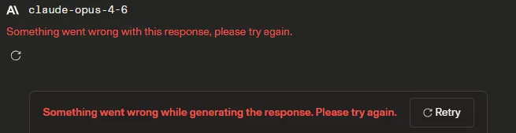

# 🤖 TG TTS Summary Bot


Telegram bot powered by local LLM ([Ollama](https://ollama.ai)) with voice synthesis via [Qwen3-TTS](https://github.com/QwenLM/Qwen3-TTS) and [Edge-TTS](https://github.com/rany2/edge-tts).

All AI processing runs locally on your GPU. Edge-TTS uses Microsoft's cloud API as a lightweight alternative.

> 💬 **Have questions about this project?** Ask [Qwen Chat](https://chat.qwen.ai/) with link to repo — it understands code and can explain how things work.

---

## ✨ Features

- 🧠 **LLM Chat** — Ask questions, get jokes, summarize chat history via Ollama
- 🔊 **Voice Synthesis** — Clone voices with Qwen3-TTS (local GPU) or use Edge-TTS (cloud)
- 📡 **Streaming** — LLM responses stream in real-time with message editing
- 💭 **Thinking Display** — Shows model reasoning in collapsible blockquotes
- 📊 **Chat Summarization** — Summarize group chat history with custom styles
- 💬 **Dialog Mode** — Private chat with memory and system prompts
- 🎙 **Voice Selection** — Inline keyboard to pick voice and engine per user
- 🔄 **GPU Management** — Automatic model swapping (LLM ↔ TTS) on single GPU

## 📋 Requirements

### My hardware
- **GPU**: NVIDIA with 8GB VRAM
- **RAM**: 16GB
- **OS**: Windows 10/11

### Software
- [Python 3.10+](https://www.python.org/downloads/)
- [Ollama](https://ollama.ai) — local LLM inference
- [FFmpeg](https://ffmpeg.org/download.html) — audio conversion
- [SoX](https://sourceforge.net/projects/sox/files/sox/14.4.2/) — required by Qwen-TTS

## 🚀 Installation

### 1. Clone the repository

```bash
git clone https://github.com/klimromanyuk/tg-tts-sum-bot.git
cd tg-tts-sum-bot
```

### 2. Create virtual environment

```bash
python -m venv venv
venv\Scripts\activate
```

### 3. Install dependencies

```bash
pip install -r requirements.txt
```

> **💡 Reusing PyTorch from ComfyUI** (saves ~2GB disk space):
> If you have ComfyUI with PyTorch installed, create a file:
> ```
> venv\Lib\site-packages\comfyui_packages.pth
> ```
> With one line — path to ComfyUI's site-packages:
> ```
> D:\programs\ComfyUI\venv\Lib\site-packages
> ```
> Then install remaining dependencies without torch:
> ```bash
> pip install qwen-tts --no-deps
> pip install python-telegram-bot aiohttp edge-tts soundfile numpy python-dotenv
> pip install transformers accelerate safetensors librosa onnxruntime sox
> ```
> If pip asks for newer versions of the libraries, agree. This will not affect venv ComfyUI

### 4. Install Ollama

1. Download from [ollama.ai](https://ollama.ai)
2. Install and run
3. Pull a model:
```bash
ollama pull huihui_ai/qwen3-abliterated:14b-v2-q4_K_M
```
> I used this model in tests

### 5. Install FFmpeg

1. Download from [ffmpeg.org](https://ffmpeg.org/download.html) or use a pre-built binary
2. Note the path to `ffmpeg.exe`

### 6. Install SoX

1. Download from [SourceForge](https://sourceforge.net/projects/sox/files/sox/14.4.2/sox-14.4.2-win32.zip)
2. Extract to a folder (e.g., `C:\programs\sox`)
3. Add that folder to your system PATH
> Have problems here? Ask [Qwen Chat](https://chat.qwen.ai/)

### 7. Configure

Copy the example environment file:
```bash
copy .env.example .env
```

Edit `.env` with your values:
```env
# Get from @BotFather on Telegram
TELEGRAM_TOKEN=your_bot_token

# Group chat IDs (use @userinfobot to find)
ALLOWED_CHAT_IDS=-100xxxxxxxxxx

# Your Telegram user ID (first = owner)
ALLOWED_DM_USERS=your_user_id

# Path to ffmpeg
FFMPEG_PATH=C:\path\to\ffmpeg.exe
```

### 8. Run

```bash
python bot.py
```

Or double-click `run.bat`.

## 🎙 Voice Setup (Qwen3-TTS)

Qwen3-TTS can clone any voice from a short audio sample.

### Preparing a voice

1. Record or find a **5-15 second** clear speech sample (WAV format)
2. Create a folder in `voices/`:
```
voices/my_voice/
├── reference.wav    ← your audio sample
└── meta.json        ← metadata
```

3. Create `meta.json`:
```json
{
  "ref_text": "Exact transcription of what is said in reference.wav"
}
```

> ⚠️ `ref_text` must **exactly** match the speech in the audio file. This is critical for quality.

4. Register the voice in `config.py`:
```python
QWEN_VOICES = {
    "my_voice": {"name": "My Voice", "emoji": "🎤"},
}
```
> Tag used as ID in comands. `name` and `emoji` used in inline keyboard.

5. Run the preparation script:
```bash
python -m tools.prepare_voices
```

This creates `prompt.qvp` — a reusable voice profile.

### Testing voices

```bash
python -m tools.test_voices
```

Interactive tool to test both Qwen and Edge-TTS voices.

>💡 If you want to change existing voice, just delete the `.qvp` file. Don't forget to update `meta.json`. Then run `prepare_voices` again.
>If you want to add a voice, create a new folder inside `voices/` and run `prepare_voices`. It will ignore existing voices with `.qvp` files inside folders.

## 📖 Commands

### Group & DM Commands
| Command | Description |
|---------|-------------|
| `/help` | Full help with all commands and voices |
| `/joke` | Generate a joke (add topic: `/joke about cats`) |
| `/ask <question>` | Ask LLM a question (reply for context) |
| `/sum` | Summarize chat messages |
| `/sumone` | Summarize a single message (reply) |
| `/tts <text>` | Text-to-speech |
| `/tts voice_id <text>` | TTS with specific voice (one-time) |
| `/voice` | Choose voice and TTS engine |
| `/autovoice` | Toggle automatic voice for LLM responses |
| `/status` | Bot status (GPU, model, queue, uptime) |

### Summarization Options
```
/sum              ← all messages that fit in context
/sum 50           ← max 50 messages
/sum like a fairy tale  ← with custom style
/sum 50 like a poem     ← max 50 + style
```
>Reply to a message: summarizes FROM that message forward.

### DM-Only Commands
| Command | Description |
|---------|-------------|
| `/q <question>` | One-shot question (no memory) |
| `/chat` | Toggle dialog mode (remembers context) |
| `/newchat` | Clear dialog history |
| `/system <prompt>` | Set system prompt for dialog |
| `/model` | List/switch Ollama models |

### Owner Commands
| Command | Description |
|---------|-------------|
| `/settings` | Show current settings |
| `/set <key> <value>` | Change a setting |
| `/unload` | Force unload GPU |
| `/allow <user_id>` | Grant DM access to a user |

### Available Settings (`/set`)
| Key | Description | Default |
|-----|-------------|---------|
| `context` | Context window (tokens) | 16384 |
| `temperature` | LLM temperature | 0.8 |
| `max_tokens` | Max response length | 2048 |
| `tts_max_tokens` | Max TTS generation tokens | 1024 |
| `response_reserve` | Token reserve for response | 1024 |
| `show_thinking` | Show model thinking | on |
| `thinking_sum` | Show thinking in summaries | off |
| `tts_language` | TTS language (auto/Russian/English/...) | auto |

## 🏗 Architecture

```
bot.py              ← Entry point, handler registration
handlers/           ← Telegram command handlers
  access.py         ← Permission decorators
  helpers.py        ← Streaming, TTS, shared logic
  common.py         ← /help, /status
  llm.py            ← /joke, /ask, /q, /chat
  summarize.py      ← /sum, /sumone
  tts_handlers.py   ← /tts, /voice, /autovoice
  admin.py          ← /set, /model, /unload
  callbacks.py      ← Inline button handlers
services/           ← Backend services
  llm_service.py    ← Ollama API + stream parsing
  tts_service.py    ← Qwen3-TTS inference
  edge_tts_service.py ← Edge-TTS cloud API
  gpu_manager.py    ← GPU state management
  queue_manager.py  ← Async task queue
  voice_manager.py  ← Voice profile loading
utils/              ← Utilities
  text_processor.py ← Markdown→HTML, chunking
  audio_converter.py ← WAV→OGG via ffmpeg
  user_manager.py   ← Per-user settings (JSON)
  settings_manager.py ← Global settings (JSON)
  message_buffer.py ← Chat message buffer
  chat_memory.py    ← DM dialog memory
tools/              ← Standalone scripts
  prepare_voices.py ← Voice profile generator
  test_voices.py    ← Voice testing tool
  __edge_tts_diag.py ← Test why Edge-TTS is not working. Send the output to Qwen
```

### GPU Management

Only one model fits in (my) 8GB VRAM at a time:

```
Idle ──→ Ollama (LLM request) ──→ stays loaded
                                      │
                                      ↓ (TTS request)
                               Unload Ollama
                                      │
                                      ↓
                                Load Qwen-TTS ──→ stays loaded
                                      │
                                      ↓ (LLM request)
                               Unload TTS → Load Ollama
```

Edge-TTS runs in the cloud — no GPU needed, works alongside Ollama.

## 🌐 Localization

The bot supports multiple languages. Switch by editing `texts.py`:

```python
# Russian (default)
from texts_ru import *

# English
# from texts_en import *
```

LLM prompts respond in the language of the user's message. If the message is empty, LLM will respond in the localization language.

### BotFather Commands

For `/setcommands` in @BotFather:

<details>
<summary>English</summary>

```
joke - Tell a joke
ask - Ask LLM a question
sum - Summarize chat messages
sumone - Summarize one message (reply)
tts - Text-to-speech
voice - Choose voice and engine
autovoice - Toggle auto-voicing
status - Bot status
help - Full help
q - One-shot question (DM)
chat - Toggle dialog mode (DM)
newchat - Clear dialog context (DM)
system - Set system prompt (DM)
model - List/switch models (DM)
unload - Force unload GPU (owner)
settings - Show settings (owner)
set - Change setting (owner)
allow - Grant DM access (owner)
```

</details>

<details>
<summary>Russian</summary>

```
joke - Анекдот от LLM
ask - Вопрос к LLM
sum - Суммаризация чата
sumone - Суммаризация одного сообщения (реплай)
tts - Озвучить текст
voice - Выбрать голос и движок
autovoice - Вкл/выкл автоозвучку
status - Состояние бота
help - Справка по боту
q - Одиночный вопрос (ЛС)
chat - Вкл/выкл режим диалога (ЛС)
newchat - Очистить контекст диалога (ЛС)
system - Системный промпт (ЛС)
model - Список/смена модели (ЛС)
unload - Выгрузить GPU (владелец)
settings - Показать настройки (владелец)
set - Изменить настройку (владелец)
allow - Добавить пользователя (владелец)
```

</details>

<details>
<summary>中文 (Chinese Simplified)</summary>

```
joke - 讲个笑话
ask - 向LLM提问
sum - 总结聊天记录
sumone - 总结单条消息（回复）
tts - 文字转语音
voice - 选择语音和引擎
autovoice - 开关自动语音
status - 机器人状态
help - 帮助信息
q - 单次提问（私聊）
chat - 开关对话模式（私聊）
newchat - 清除对话上下文（私聊）
system - 设置系统提示词（私聊）
model - 查看/切换模型（私聊）
unload - 强制卸载GPU（管理员）
settings - 显示设置（管理员）
set - 修改设置（管理员）
allow - 授权用户私聊（管理员）
```

</details>

<details>
<summary>Español (Spanish)</summary>

```
joke - Contar un chiste
ask - Hacer una pregunta al LLM
sum - Resumir mensajes del chat
sumone - Resumir un mensaje (respuesta)
tts - Texto a voz
voice - Elegir voz y motor
autovoice - Activar/desactivar voz automática
status - Estado del bot
help - Ayuda completa
q - Pregunta única (MD)
chat - Activar/desactivar modo diálogo (MD)
newchat - Limpiar contexto del diálogo (MD)
system - Establecer prompt del sistema (MD)
model - Listar/cambiar modelos (MD)
unload - Forzar descarga de GPU (propietario)
settings - Mostrar configuración (propietario)
set - Cambiar configuración (propietario)
allow - Autorizar usuario en MD (propietario)
```

</details>

<details>
<summary>Deutsch (German)</summary>

```
joke - Einen Witz erzählen
ask - Eine Frage an das LLM stellen
sum - Chat-Nachrichten zusammenfassen
sumone - Eine Nachricht zusammenfassen (Antwort)
tts - Text-zu-Sprache
voice - Stimme und Engine auswählen
autovoice - Automatische Sprachausgabe ein/aus
status - Bot-Status
help - Vollständige Hilfe
q - Einzelne Frage (DM)
chat - Dialogmodus ein/aus (DM)
newchat - Dialogkontext löschen (DM)
system - System-Prompt festlegen (DM)
model - Modelle auflisten/wechseln (DM)
unload - GPU zwangsweise entladen (Besitzer)
settings - Einstellungen anzeigen (Besitzer)
set - Einstellung ändern (Besitzer)
allow - Benutzer für DM freigeben (Besitzer)
```

</details>

## ⚠️ Known Issues

- **Edge-TTS regional restrictions**: May not work in some countries. If you experience issues, please ask Qwen and send him output from `tools.__edge_tts_diag`. Use Qwen-TTS as an alternative.
- **Qwen3-TTS infinite generation**: Known upstream bug. The bot uses timeouts and retries with reduced token limits as a workaround.
- **Thinking models**: Some models write `<think>` tags in responses regardless of settings. The bot filters these out automatically. Use `/set show_thinking off` to hide the thinking display.

## 📄 License

[Apache License 2.0](LICENSE)

## 🙏 Acknowledgments

- [Ollama](https://ollama.ai) — Local LLM inference
- [Qwen3-TTS](https://github.com/QwenLM/Qwen3-TTS) — Voice cloning model by Alibaba
- [Edge-TTS](https://github.com/rany2/edge-tts) — Microsoft Edge TTS API
- [python-telegram-bot](https://python-telegram-bot.org/) — Telegram Bot API wrapper

